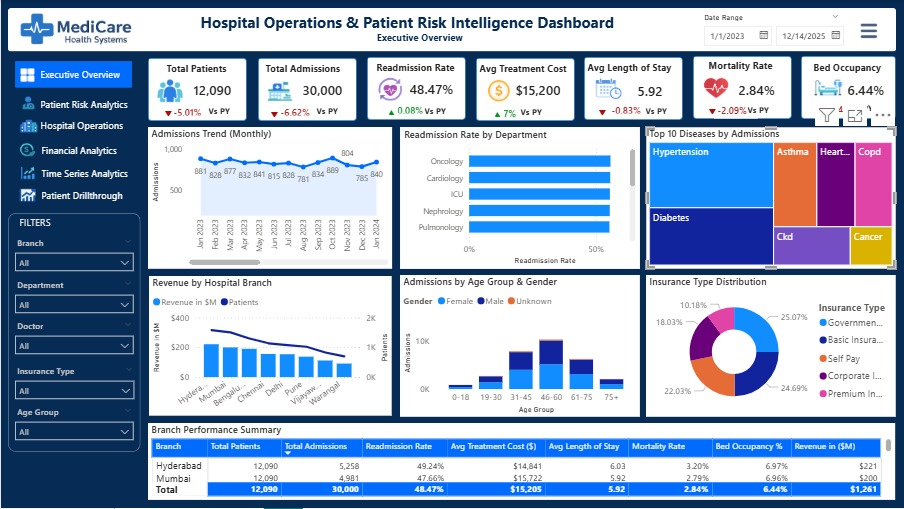

# Recommendations & Strategic Insights

Based on the dashboard analysis, the following recommendations can help improve hospital operations, patient care, and financial performance.

---

## Dashboard Preview

## 1. Reduce Readmission Rates

### Observation
Certain departments such as ICU, Cardiology, and Oncology show higher readmission rates.

### Recommendation
- Improve post-discharge follow-up processes
- Introduce patient monitoring programs
- Enhance treatment quality checks
- Provide patient education before discharge

### Expected Outcome
- Reduced readmission costs
- Improved patient satisfaction
- Better healthcare quality metrics

---

## 2. Optimize Bed Occupancy Management

### Observation
Bed occupancy rates are high in specific branches and departments.

### Recommendation
- Improve patient discharge planning
- Expand bed capacity in high-demand departments
- Use predictive analytics for patient inflow forecasting

### Expected Outcome
- Reduced overcrowding
- Better hospital resource utilization
- Improved patient management

---

## 3. Focus on High-Risk Diseases

### Observation
Diseases such as Hypertension, Diabetes, Heart Disease, and CKD contribute to the highest admissions.

### Recommendation
- Launch preventive healthcare programs
- Conduct awareness campaigns
- Improve chronic disease management systems

### Expected Outcome
- Reduced emergency admissions
- Better long-term patient outcomes
- Lower treatment costs

---

## 4. Improve Financial Performance

### Observation
Some hospital branches generate lower revenue despite high patient volume.

### Recommendation
- Optimize operational costs
- Improve insurance claim processing
- Increase efficiency in treatment workflows
- Analyze branch-wise profitability

### Expected Outcome
- Increased profitability
- Better financial stability
- Improved revenue cycle management

---

## 5. Enhance Insurance Coverage Strategy

### Observation
A significant percentage of patients rely on government and basic insurance.

### Recommendation
- Strengthen partnerships with insurance providers
- Improve claim approval processes
- Introduce flexible healthcare packages

### Expected Outcome
- Faster reimbursements
- Improved patient accessibility
- Better financial management

---

## 6. Improve Elderly Patient Care

### Observation
Higher admissions are observed in the 61+ age groups.

### Recommendation
- Introduce specialized geriatric care programs
- Increase monitoring for elderly patients
- Improve chronic disease support systems

### Expected Outcome
- Better elderly patient outcomes
- Reduced mortality rates
- Improved quality of care

---

## 7. Implement Predictive Analytics

### Observation
Current analytics are descriptive and historical.

### Recommendation
- Implement AI/ML models for:
  - Readmission prediction
  - Disease forecasting
  - Bed occupancy forecasting
  - Patient risk scoring

### Expected Outcome
- Proactive healthcare management
- Early risk detection
- Improved operational planning

---

# Final Business Impact

By implementing these recommendations, hospitals can achieve:

- Improved patient outcomes
- Reduced readmission and mortality rates
- Better operational efficiency
- Optimized hospital resource utilization
- Increased financial performance
- Enhanced patient satisfaction
- Data-driven healthcare decision-making